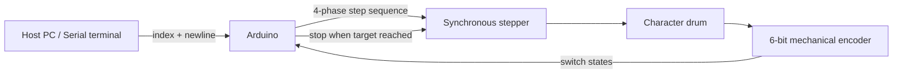

# SBB Fallblattanzeiger Driver

Arduino firmware to bring decommissioned **SBB split-flap displays** (*Fallblattanzeiger*) back to life.

**SBB** stands for *Schweizerische Bundesbahn* — the Swiss Federal Railways. These mechanical arrival boards were (and in some places still are) used on platforms to show train destinations, times, and track numbers. Each character is a physical flap on a rotating drum, driven by a synchronous stepper motor and indexed by a mechanical encoder.

## Demo Video

[](https://www.youtube.com/watch?v=OfIBiMtTApw)

**Watch:** [https://www.youtube.com/watch?v=OfIBiMtTApw](https://www.youtube.com/watch?v=OfIBiMtTApw)

---

## How It Works



1. You send a **character index** (0–38) over serial.
2. The firmware steps the motor **backward**, one full-step cycle per main-loop iteration.
3. Six encoder switches report the drum position as a 6-bit pattern.
4. At each encoder **gap** event (see below), the firmware checks whether the current pattern matches the target.
5. On a match, the motor is de-energized and movement stops.

---

## Hardware Requirements

| Component | Notes |
|-----------|-------|
| Arduino-compatible board | Tested layout assumes Uno/Nano-class pin numbering |
| Original SBB split-flap module | With synchronous motor and 6-switch encoder |
| Motor driver / shield | Must expose separate power and direction lines for two coils |
| USB serial connection | 9600 baud for commands and debug output |

### Pinout

| Arduino Pin | Function |
|-------------|----------|
| 2 | Motor coil A — direction (`dir_a`) |
| 3 | Motor coil A — power (`pwr_a`) |
| 4 | Encoder bit 5 (MSB) |
| 5 | Encoder bit 4 |
| 6 | Encoder bit 3 |
| 7 | Encoder bit 2 |
| 8 | Motor coil B — direction (`dir_b`) |
| 9 | Motor coil B — power (`pwr_b`) |
| 10 | Encoder bit 1 |
| 11 | Encoder bit 0 (LSB) |

All encoder pins use `INPUT_PULLUP` — switches pull the line **LOW** when active (closed to ground).

Motor pins are driven in a 4-phase full-step pattern. Reference: [full-step stepping diagram](http://www.8051projects.net/stepper-motor-interfacing/full-step.gif).

---

## Software Setup

### Dependencies

- [Arduino IDE](https://www.arduino.cc/en/software) (or PlatformIO)
- [Bounce2](https://github.com/thomasfredericks/Bounce2) — install via **Sketch → Include Library → Manage Libraries**, search for `Bounce2`

### Upload

1. Open `fallblatt_sbb.ino` in the Arduino IDE.
2. Select your board and serial port.
3. Upload the sketch.

---

## Usage

Open the serial monitor (or any terminal) at **9600 baud**, with **newline** line ending.

Send a single integer followed by a newline to rotate to that character index:

```
12
```

The firmware echoes the received index, then steps the drum until the encoder reports the matching position.

### Debug Output

On each encoder gap event, the firmware prints a debug line:

```
101011:100111:110000
```

| Field | Meaning |
|-------|---------|
| First 6 digits | Raw switch states (pins 4–7, 10, 11) |
| Middle (binary) | Gap event counter |
| Last (binary) | Current 6-bit encoder pattern |

When the target is reached:

```
---end of cycel-----
```

---

## Encoder Decoding

### 6-bit position word

`readCurrentState()` packs the six debounced switch readings into one byte. Pin 4 maps to bit 5 (MSB), pin 11 maps to bit 0 (LSB):

```
bit 5 ← pin 4
bit 4 ← pin 5
bit 3 ← pin 6
bit 2 ← pin 7
bit 1 ← pin 10
bit 0 ← pin 11
```

A switch reading of `1` (HIGH / open) sets the bit; `0` (LOW / closed) clears it.

### Character lookup table

The `labelSequence[]` array maps indices to encoder patterns. Index 0 corresponds to `"0."` on the **hour module**, index 1 to `"1."`, and so on — 39 positions in total:

| Index | Pattern (binary) | Index | Pattern (binary) |
|-------|------------------|-------|------------------|
| 0 | `110000` | 20 | `101100` |
| 1 | `010001` | 21 | `001101` |
| 2 | `010000` | 22 | `001100` |
| 3 | `100011` | 23 | `111011` |
| 4 | `100010` | 24 | `111010` |
| 5 | `110011` | 25 | `011011` |
| 6 | `000101` | 26 | `011010` |
| 7 | `110111` | 27 | `111001` |
| 8 | `111110` | 28 | `111000` |
| 9 | `011111` | 29 | `011001` |
| 10 | `011110` | 30 | `011000` |
| 11 | `111101` | 31 | `101011` |
| 12 | `111100` | 32 | `101010` |
| 13 | `011101` | 33 | `001011` |
| 14 | `011100` | 34 | `010100` |
| 15 | `101111` | 35 | `100100` |
| 16 | `101110` | 36 | `110010` |
| 17 | `001111` | 37 | `010011` |
| 18 | `001110` | 38 | `110001` |
| 19 | `101101` | | |

> **Note:** This table is specific to one module type (hour drum). Other drums (minutes, letters, symbols) will have different sequences.

### Gap detection

`gapValue()` returns `1` when **all six** encoder switches read HIGH simultaneously. This corresponds to a mechanical gap or blank region on the encoder disc — a once-per-revolution index mark.

The firmware uses `gap.fell()` (transition from gap → non-gap) as the sampling instant: at that moment it reads the encoder pattern and compares it against `labelSequence[targetScreen]`. Sampling at the gap edge avoids reading ambiguous in-between states while the drum is moving.

---

## Motor Timing

### Step sequence

`Step4FWD()` and `Step4BWD()` each execute one **4-phase full-step cycle** (four coil states, then done). The `NumberOfTimes` parameter exists but its loop is currently commented out — each call always performs exactly one cycle.

The main loop calls `Step4BWD(1)` once per iteration while `motor == 1`, so the drum advances one step per loop pass.

### Step delay

```cpp
int stepDelay = 5;  // milliseconds between coil states
```

Despite an older comment saying "microseconds", `delay()` on Arduino takes **milliseconds**. At `stepDelay = 5`, one full 4-step cycle takes roughly 20 ms. Lower values spin faster but may cause missed steps or excessive current; raise the value if the motor stalls or overheats.

### Coil de-energizing

`TurnOfMotors()` drives all four motor pins LOW when the target position is reached. Keeping coils energized when idle heats the windings and wears the mechanism — always stop cleanly.

---

## Architecture Overview

```
┌─────────────┐     serial      ┌──────────────────┐
│  Host       │ ──────────────► │  fallblatt_sbb   │
│  (9600 baud)│ ◄────────────── │  .ino            │
└─────────────┘   debug/status  └────────┬─────────┘
                                           │
                          ┌────────────────┼────────────────┐
                          ▼                ▼                ▼
                   ┌──────────┐    ┌──────────┐    ┌──────────────┐
                   │ Stepper  │    │ Bounce2  │    │ labelSequence│
                   │ driver   │    │ debounce │    │ lookup table │
                   │ (4 pins) │    │ (6 pins) │    │ (39 entries) │
                   └──────────┘    └──────────┘    └──────────────┘
```

---

## Known Limitations

- **Backward only** — the firmware always steps in reverse; there is no shortest-path logic to choose forward vs. backward.
- **Single module** — one drum per Arduino; a full display row needs multiple controllers or a refactored protocol.
- **No bounds checking** — serial indices outside 0–38 are accepted but will never match and the motor will run indefinitely.
- **Module-specific table** — `labelSequence` is calibrated for the hour drum; other module types need their own tables.

---

## Possible Improvements

- Shortest-path rotation (compare current index to target, pick `Step4FWD` or `Step4BWD`)
- Multi-module protocol, e.g. `module,character\n`
- Bounds checking and serial error responses
- `platformio.ini` for reproducible builds
- Separate lookup tables per drum type (hour, minute, alpha)

---

## License

No license file is included yet. Contact the repository owner for usage terms.

## Author

Initial implementation by [Oye](mailto:oye@swissonline.ch).